# Tines Desktop User Guide

This guide was generated from the live Electron app by connecting directly to its Chrome DevTools Protocol endpoint.

## App Overview

Tines Desktop is a local desktop companion for Tines. It helps you:

- browse stories safely in a read-only workflow
- inspect execution behavior with visual and table-based debugging tools
- look up old incidents by Event ID and Story Run GUID
- save investigations locally with notes, screenshots, and evidence artifacts
- separate safe browsing from mutation-capable editing

## 1. Connection Profiles

The app opens on the **connection profile** screen. This is where you select a saved workspace profile or add a new tenant connection. For day-to-day use, this keeps Tines tenant selection local and repeatable.

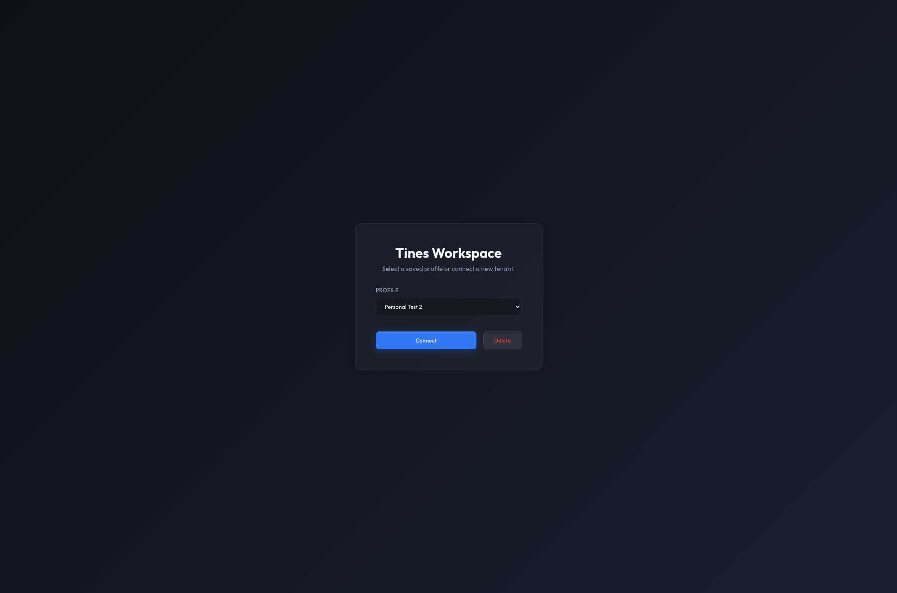

Why this matters:

- quick switching between saved environments
- local profile management for repeated use
- a safer entry point than retyping credentials each session

How credentials are handled:

- saved profiles are written to an encrypted file in the Electron user-data directory
- the app uses Electron `safeStorage` for encryption at rest when the OS-backed encryption service is available
- in this codebase, profiles are stored in `tines-profiles.enc`, and the token is decrypted only when the app loads the saved profile into the active session
- the practical goal is that your bearer token is not stored as plain JSON on disk under normal supported desktop conditions

Important caveat:

- if Electron reports that `safeStorage` encryption is not available on the current machine, the implementation falls back to storing the serialized profile data without OS-backed encryption
- so the intended security model is encrypted-at-rest profile storage, but the actual protection depends on `safeStorage.isEncryptionAvailable()` on the host OS
- in normal desktop use, this should usually be available on macOS and Windows
- by inference from Electron's Windows DPAPI behavior, this should also usually be available on normal Windows Server installs once the app is running and ready
- the more likely edge cases are unusual Linux environments, stripped-down VMs, containers, or systems without a working desktop secret store

## 2. Dashboard

The **Dashboard** is the read-only entry point for normal story exploration. It shows the browse-first posture of the app and gives you access to story cards, forensic lookup, and the main navigation.

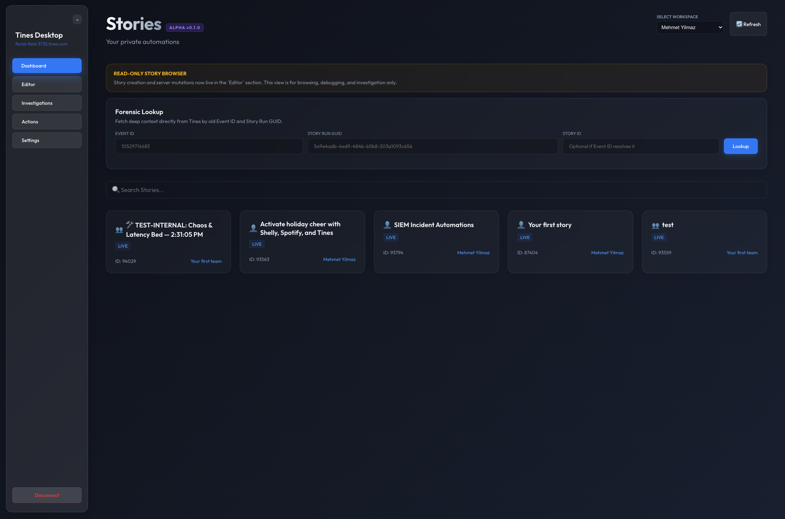

How it helps with Tines:

- review stories without mutating the tenant
- jump into investigation flows from one place
- start forensic work without digging through the web UI first

## 3. Forensic Lookup

**Forensic Lookup** is built for incident follow-up. When you have an old **Event ID** or **Story Run GUID**, it can pull story context, action context, run context, and downloadable artifacts into one place.

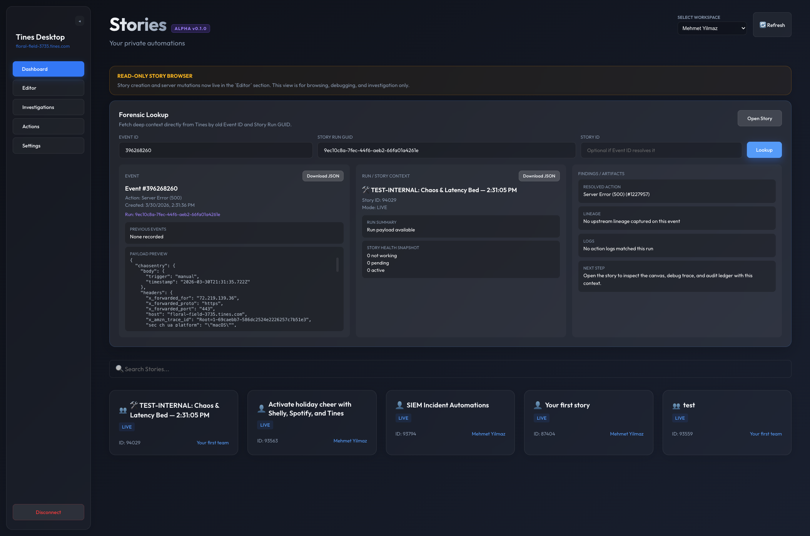

Use this when:

- someone gives you a historic event identifier
- you need to reconnect an old incident to a story
- you want a fast bridge from raw Tines IDs to a concrete investigation

Why it is valuable:

- it reduces the time spent manually hunting through the Tines UI for the right story, run, and action
- it converts raw identifiers into a structured investigation surface with event, run, lineage, and story context
- it gives you downloadable artifacts so the incident can be preserved locally, even when you are piecing together older evidence
- it is especially useful when an issue report starts outside the app, such as from a ticket, chat message, on-call handoff, or audit trail

What it is trying to do operationally:

- start from the smallest piece of evidence you already have
- resolve that evidence back to the story and action that produced it
- give you enough surrounding context to decide whether you need a quick answer, a deeper debugger session, or a saved investigation

## 4. Story Canvas

Opening a story from Dashboard lands in a read-only **Story Canvas**. The normal browse flow keeps the graph visible and interactive for investigation without exposing mutation controls.

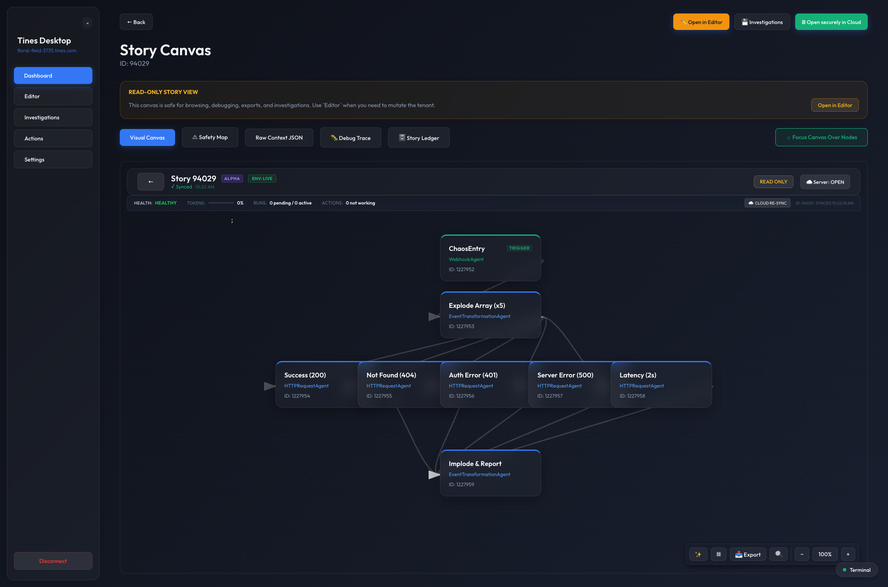

What this gives you:

- safe canvas review
- story metadata and operational badges
- quick access to debugging and audit tools

## 5. Organize Chart

The canvas includes a local **organize chart** action through the `✨` auto-layout control. This rearranges nodes for easier inspection without mutating the tenant when you are in the read-only flow.

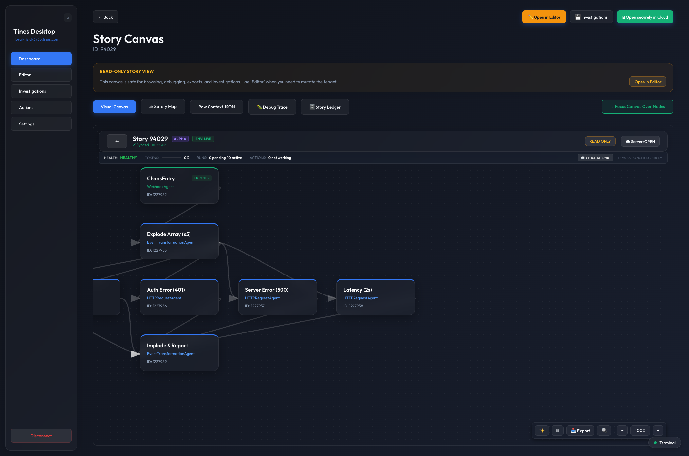

Why it helps:

- makes dense graphs easier to read
- reduces overlap before debugging or export
- improves visual review without changing the server-side story

## 6. Safety Map

The **Safety Map** overlays safety classification on the graph. It is meant to help you distinguish safer nodes from more interactive or mutating ones at a glance.

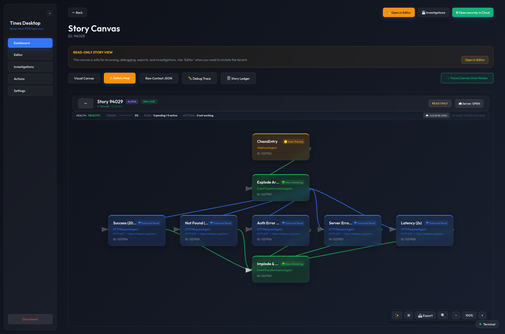

How to read it:

- safety tiers are color-coded and summarized in the legend
- this is useful when reviewing blast radius or change risk
- it helps you reason about which nodes are safer to inspect versus which nodes deserve more caution

Why this matters in real Tines work:

- not every problem is a hard failure; sometimes the issue is that bad data was allowed to continue downstream through several actions before it became obvious
- the Safety Map helps you reason about where problematic data can be re-emitted, transformed, forwarded, or turned into side effects
- a mutating or highly interactive downstream node is usually a more important review point than a passive read-only node when tracing blast radius

Examples of how to use it:

- if bad input entered a workflow, use the map to identify which downstream branches are more likely to have re-emitted or propagated that bad data
- if an incident involved accidental writes, use the map to focus on nodes that could have caused side effects in external systems
- if you are reviewing a complex automation before enabling or modifying it, use the map to understand which parts of the graph are low-risk observers versus high-impact emitters

What the map is for:

- blast-radius review
- tracing potentially harmful data flow
- deciding where to inspect first after a bad payload or misfire
- communicating operational risk to another engineer without reading every node definition line by line

## 7. Debug Trace

**Debug Trace** is the visual execution view. It helps you scan recent runs, see health signals over the graph, and spot where something may be blocked or degraded.

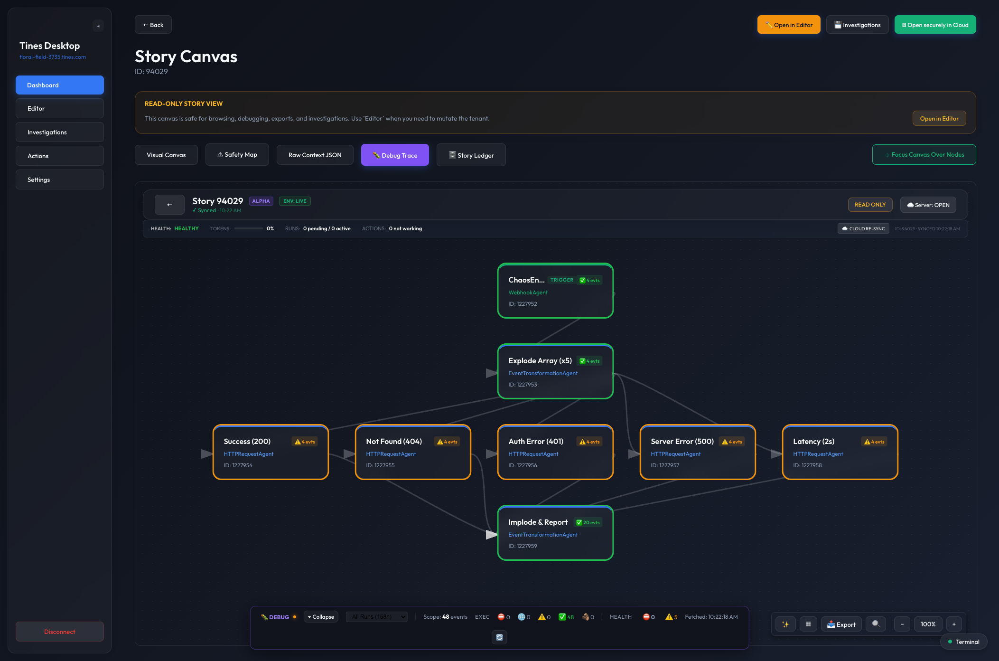

Why it matters:

- fast triage across a whole story
- run-scoped or all-runs review
- visual identification of suspect nodes before deeper inspection

## 8. Story Audit Ledger

The **Story Audit Ledger** is the structured forensic surface. It is better than the canvas when you need exact execution rows, event IDs, run GUIDs, and impact-oriented review.

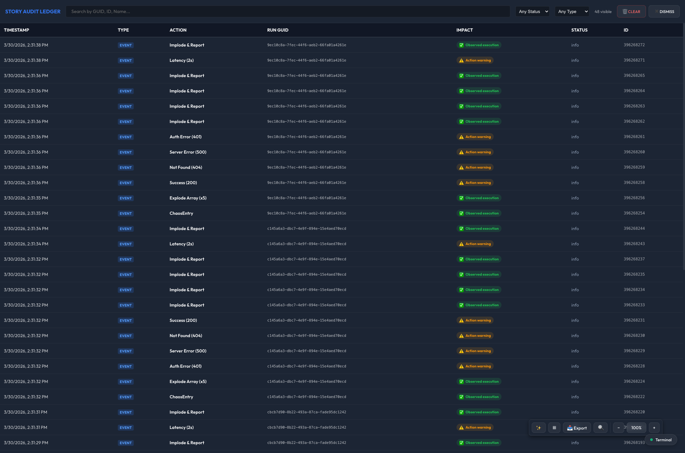

Use it to:

- inspect execution evidence row by row
- compare activity across runs
- anchor debugging with concrete identifiers

## 9. Saving Investigations

Inside a story, the **Investigations** panel is focused on saving the current context. You can record status, summary, findings, selected run context, and local artifacts for later reopening.

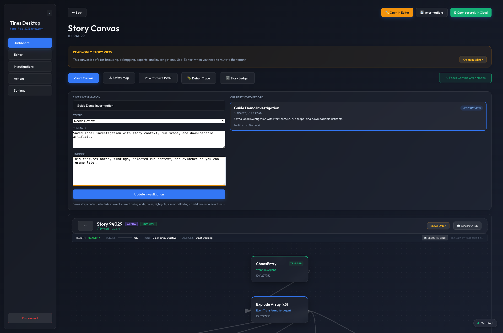

This helps when:

- you want to pause and resume an investigation later
- you need to preserve a debugging context before switching stories
- you want a local evidence bundle with notes

What investigations are really for:

- turning an ad hoc debugging session into a durable local case record
- preserving not just raw evidence, but your working interpretation of that evidence
- allowing you to resume a story/run review without rebuilding the whole mental state from scratch

What gets preserved conceptually:

- which story you were looking at
- which run or event mattered
- which node you were focused on
- what you thought was happening
- what artifacts were worth keeping

Why that is useful:

- many Tines investigations are iterative rather than one-pass
- evidence can be spread across run context, ledger rows, screenshots, and notes
- older evidence may age out of remote retention, so a local saved investigation can become the most stable record of what you found

How to think about investigations:

- not a shared Tines case-management system
- not a replacement for the Tines UI
- a local forensic notebook that preserves debugging state, findings, and evidence for later use

## 10. Investigations Browser

Saved investigations live in their own dedicated top-level section. This is your local library for reopening, duplicating, exporting, and managing saved forensic sessions.

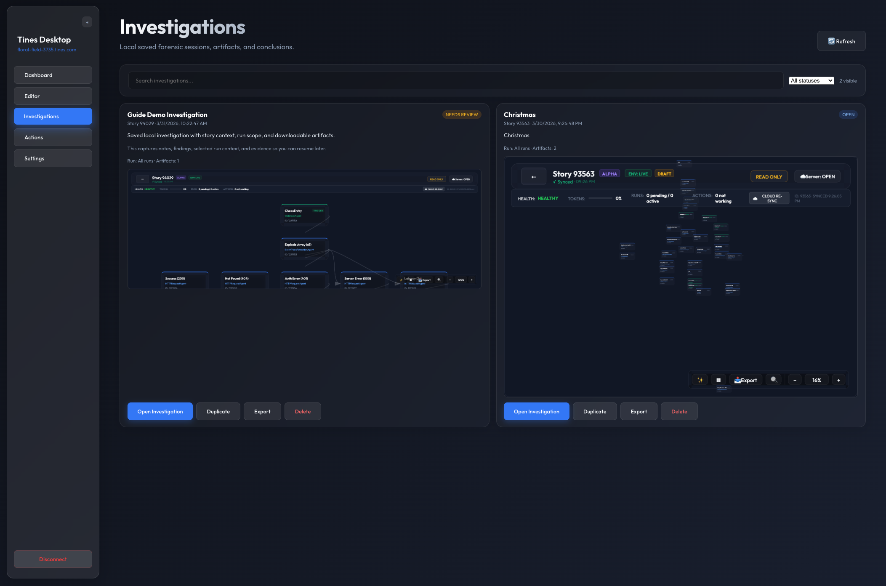

Benefits:

- persistent local case history
- quick return to prior findings
- exportable local records

## 11. Editor

The **Editor** is intentionally separated from the normal dashboard workflow. It is the mutation-capable area of the app and is marked with a warning because it is still incomplete. The current safety posture of the product is that normal browsing happens in Dashboard/Story Canvas, while editing is isolated here.

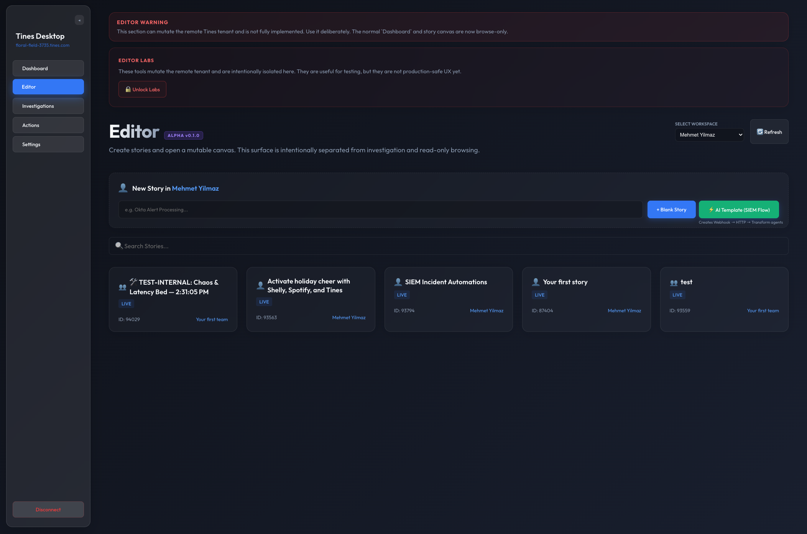

Why the split matters:

- keeps everyday investigation safer
- makes mutation intent explicit
- avoids mixing browsing and editing concerns

Recommendation:

- do not rely on the current Editor as a primary editing workflow yet
- use it carefully and assume the safer path is still the read-only investigation flow unless you explicitly need to test editor behavior

## 12. Settings

The **Settings** page is for configuration, tenant context, and local debugger defaults. It is no longer used as a catch-all surface for editing features.

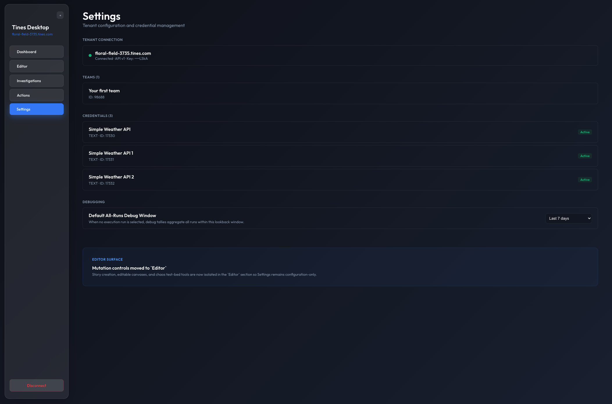

This area supports:

- tenant configuration
- connection-oriented settings
- local operational defaults for the rest of the app

## Debugging Limitations

The debugger is useful, but it is important to understand where the current Tines API limits what the desktop app can prove.

Supported strengths:

- the app can reconstruct execution history from story events, action events, run detail, and cached local evidence
- it can use supported REST live-activity fields such as pending runs, not-working counts, and recent error indicators to show operational health
- it can save local evidence and preserve your investigation state even when you leave the story

Current Tines API limitation:

- the desktop app does not always get the same action-log detail that the native Tines web UI shows
- in testing, supported REST `GET /api/v1/actions/{id}/logs` returned empty arrays for chaos-story actions where the Tines UI clearly showed `401`, `404`, and `500` style failures
- the richer browser-side GraphQL log shape that Tines uses was not reliably available to the desktop app under its bearer-auth model

What that means in practice:

- **Debug Trace** is strongest at showing what executed and which supported health signals look bad
- it is weaker at reproducing every exact log message the Tines web UI may show for a failing action
- the Story Audit Ledger and health summaries should be read as supported evidence, not perfect parity with every browser-only detail in Tines

Operationally:

- use the desktop debugger to reconstruct runs, compare branches, trace evidence, and preserve findings
- when you need exact native log wording for a specific Tines action failure, the web UI may still expose detail that the supported desktop API path cannot currently reproduce

## Recommended Workflow

1. Start in **Dashboard** for safe browsing.
2. Use **Forensic Lookup** when you already have an Event ID or Story Run GUID.
3. Open the story and inspect **Debug Trace** for visual execution context.
4. Move to **Story Audit Ledger** when you need precise evidence rows.
5. Save the session into **Investigations** if the work should persist.
6. Use **Editor** only when you intentionally want mutation-capable behavior.

## Capture Info

- Window title: `tines-desktop`
- Connected URL: `http://localhost:5199/`
- Remote debug port: `9223`
