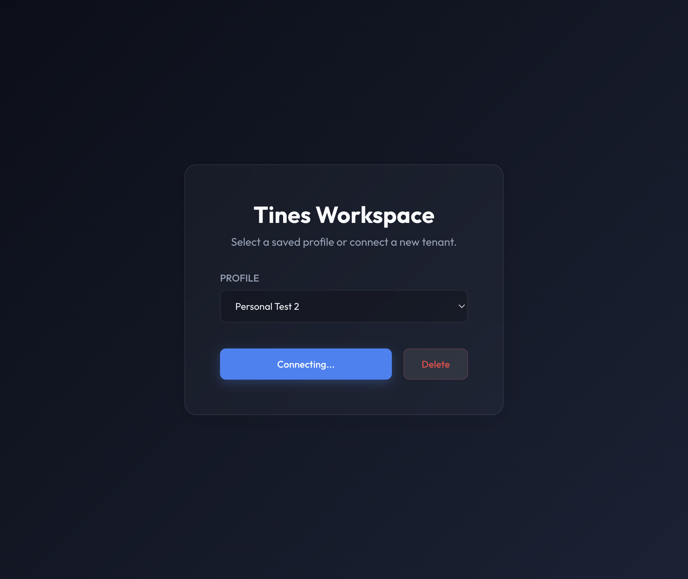
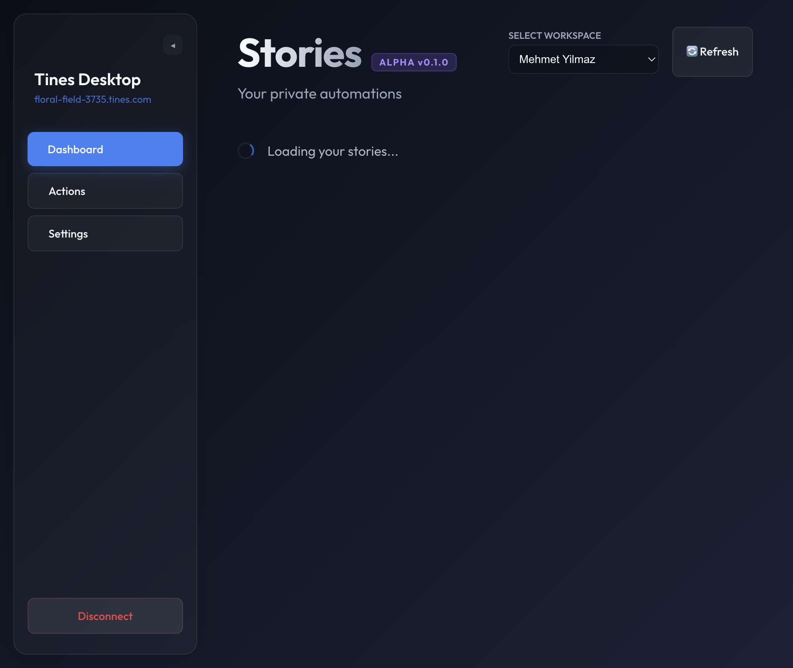

# Settings Page Guide

This guide was generated by driving the running Electron app through `@iflow-mcp/electron-mcp-server`.

## Tooling Check

- MCP tools discovered: get_electron_window_info, take_screenshot, send_command_to_electron, read_electron_logs
- Electron window discovery completed through `get_electron_window_info`

## 1. Login Shell

The app opens on the local login shell. For this walkthrough, a temporary profile was filled so the shell could move into the main application and reach the Settings page.


## 2. Settings Overview

Open **Settings** from the left sidebar. The page includes:

- tenant connection summary
- teams list
- credentials list
- the experimental labs area at the bottom



## 3. Experimental Labs

In the **Danger Zone**, the labs toggle reveals the internal testing controls. This section is where the app exposes the chaos-story scaffolding and trigger workflow.



## Notes

- Teams and credentials depend on valid Tines API access.
- The labs toggle is immediate UI state; the scaffold and trigger actions then call the tenant API.
- The current Settings subtitle is: `Tenant configuration and credential management`.

## Raw MCP Window Info

```text
Window Information:

{
  "platform": "darwin",
  "devToolsPort": 9223,
  "windows": [
    {
      "id": "8CAAABEAB707FB0300BB48E59B8C1250",
      "title": "tines-desktop",
      "url": "http://localhost:5199/",
      "type": "page",
      "description": "",
      "webSocketDebuggerUrl": "ws://localhost:9223/devtools/page/8CAAABEAB707FB0300BB48E59B8C1250"
    }
  ],
  "totalTargets": 2,
  "electronTargets": 2,
  "processInfo": {
    "electronProcesses": [
      {
        "pid": "43250",
        "cpu": "86.8",
        "memory": "0.2",
        "command": "node /Users/tenguns/Documents/Dev/tines-sdk/tines-desktop/node_modules/.bin/electron-mcp-server"
      },
      {
        "pid": "38556",
        "cpu": "0.0",
        "memory": "0.2",
        "command": "node /Users/tenguns/Documents/Dev/tines-sdk/tines-desktop/node_modules/.bin/electron-mcp-server"
      },
      {
        "pid": "37862",
        "cpu": "0.0",
        "memory": "0.3",
        "command": "/Users/tenguns/Documents/Dev/tines-sdk/tines-desktop/node_modules/electron/dist/Electron.app/Contents/Frameworks/Electron Helper (Renderer).app/Contents/MacOS/Electron Helper (Renderer) --type=renderer --user-data-dir=/Users/tenguns/Library/Application Support/tines-desktop --app-path=/Users/tenguns/Documents/Dev/tines-sdk/tines-desktop --remote-debugging-port=9223 --lang=en-US --num-raster-threads=4 --enable-zero-copy --enable-gpu-memory-buffer-compositor-resources --enable-main-frame-before-activation --renderer-client-id=5 --time-ticks-at-unix-epoch=-1774560312292009 --launch-time-ticks=343277903579 --shared-files --field-trial-handle=1718379636,r,837223487861832489,6067442120513190646,262144 --enable-features=PdfUseShowSaveFilePicker,ScreenCaptureKitPickerScreen,ScreenCaptureKitStreamPickerSonoma --disable-features=DropInputEventsWhilePaintHolding,LocalNetworkAccessChecks,MacWebContentsOcclusion,ScreenAIOCREnabled,SpareRendererForSitePerProcess,TimeoutHangingVideoCaptureStarts,TraceSiteInstanceGetProcessCreation --variations-seed-version --pseudonymization-salt-handle=1935764596,r,1381845383618911107,193288958819677656,4 --trace-process-track-uuid=3190708990997080739 --seatbelt-client=54"
      },
      {
        "pid": "37861",
        "cpu": "0.0",
        "memory": "0.2",
        "command": "/Users/tenguns/Documents/Dev/tines-sdk/tines-desktop/node_modules/electron/dist/Electron.app/Contents/Frameworks/Electron Helper (Renderer).app/Contents/MacOS/Electron Helper (Renderer) --type=renderer --user-data-dir=/Users/tenguns/Library/Application Support/tines-desktop --app-path=/Users/tenguns/Documents/Dev/tines-sdk/tines-desktop --enable-sandbox --remote-debugging-port=9223 --lang=en-US --num-raster-threads=4 --enable-zero-copy --enable-gpu-memory-buffer-compositor-resources --enable-main-frame-before-activation --renderer-client-id=4 --time-ticks-at-unix-epoch=-1774560312292009 --launch-time-ticks=343277894284 --shared-files --field-trial-handle=1718379636,r,837223487861832489,6067442120513190646,262144 --enable-features=PdfUseShowSaveFilePicker,ScreenCaptureKitPickerScreen,ScreenCaptureKitStreamPickerSonoma --disable-features=DropInputEventsWhilePaintHolding,LocalNetworkAccessChecks,MacWebContentsOcclusion,ScreenAIOCREnabled,SpareRendererForSitePerProcess,TimeoutHangingVideoCaptureStarts,TraceSiteInstanceGetProcessCreation --variations-seed-version --pseudonymization-salt-handle=1935764596,r,1381845383618911107,193288958819677656,4 --trace-process-track-uuid=3190708990060038890 --seatbelt-client=54"
      },
      {
        "pid": "37851",
        "cpu": "0.0",
        "memory": "0.1",
        "command": "/Users/tenguns/Documents/Dev/tines-sdk/tines-desktop/node_modules/electron/dist/Electron.app/Contents/Frameworks/Electron Helper.app/Contents/MacOS/Electron Helper --type=utility --utility-sub-type=network.mojom.NetworkService --lang=en-US --service-sandbox-type=network --user-data-dir=/Users/tenguns/Library/Application Support/tines-desktop --shared-files --field-trial-handle=1718379636,r,837223487861832489,6067442120513190646,262144 --enable-features=PdfUseShowSaveFilePicker,ScreenCaptureKitPickerScreen,ScreenCaptureKitStreamPickerSonoma --disable-features=DropInputEventsWhilePaintHolding,LocalNetworkAccessChecks,MacWebContentsOcclusion,ScreenAIOCREnabled,SpareRendererForSitePerProcess,TimeoutHangingVideoCaptureStarts,TraceSiteInstanceGetProcessCreation --variations-seed-version --pseudonymization-salt-handle=1935764596,r,1381845383618911107,193288958819677656,4 --trace-process-track-uuid=3190708989122997041 --seatbelt-client=33"
      },
      {
        "pid": "37850",
        "cpu": "0.0",
        "memory": "0.2",
        "command": "/Users/tenguns/Documents/Dev/tines-sdk/tines-desktop/node_modules/electron/dist/Electron.app/Contents/Frameworks/Electron Helper.app/Contents/MacOS/Electron Helper --type=gpu-process --user-data-dir=/Users/tenguns/Library/Application Support/tines-desktop --gpu-preferences=SAAAAAAAAAAgAQAEAAAAAAAAAAAAAGAAAwAAAAAAAAAAAAAAAAAAAAIAAAAAAAAAAAAAAAAAAAAQAAAAAAAAABAAAAAAAAAACAAAAAAAAAAIAAAAAAAAAA== --shared-files --field-trial-handle=1718379636,r,837223487861832489,6067442120513190646,262144 --enable-features=PdfUseShowSaveFilePicker,ScreenCaptureKitPickerScreen,ScreenCaptureKitStreamPickerSonoma --disable-features=DropInputEventsWhilePaintHolding,LocalNetworkAccessChecks,MacWebContentsOcclusion,ScreenAIOCREnabled,SpareRendererForSitePerProcess,TimeoutHangingVideoCaptureStarts,TraceSiteInstanceGetProcessCreation --variations-seed-version --pseudonymization-salt-handle=1935764596,r,1381845383618911107,193288958819677656,4 --trace-process-track-uuid=3190708988185955192 --seatbelt-client=31"
      },
      {
        "pid": "37790",
        "cpu": "0.0",
        "memory": "0.3",
        "command": "/Users/tenguns/Documents/Dev/tines-sdk/tines-desktop/node_modules/electron/dist/Electron.app/Contents/MacOS/Electron . --remote-debugging-port=9223 --remote-allow-origins=*"
      },
      {
        "pid": "37789",
        "cpu": "0.0",
        "memory": "0.1",
        "command": "node /Users/tenguns/Documents/Dev/tines-sdk/tines-desktop/node_modules/.bin/electron . --remote-debugging-port=9223 --remote-allow-origins=*"
      },
      {
        "pid": "37781",
        "cpu": "0.0",
        "memory": "0.1",
        "command": "node /Users/tenguns/Documents/Dev/tines-sdk/tines-desktop/node_modules/.bin/cross-env NODE_ENV=development electron . --remote-debugging-port=9223 --remote-allow-origins=*"
      },
      {
        "pid": "37742",
        "cpu": "0.0",
        "memory": "0.1",
        "command": "npm run electron:start"
      },
      {
        "pid": "37711",
        "cpu": "0.0",
        "memory": "0.0",
        "command": "/bin/sh -c wait-on tcp:5199 && npm run electron:start"
      },
      {
        "pid": "37709",
        "cpu": "0.0",
        "memory": "0.1",
        "command": "node /Users/tenguns/Documents/Dev/tines-sdk/tines-desktop/node_modules/.bin/concurrently -k npm run dev wait-on tcp:5199 && npm run electron:start"
      },
      {
        "pid": "36794",
        "cpu": "0.0",
        "memory": "0.2",
        "command": "node /Users/tenguns/Documents/Dev/tines-sdk/tines-desktop/node_modules/.bin/electron-mcp-server"
      },
      {
        "pid": "33681",
        "cpu": "0.0",
        "memory": "0.2",
        "command": "node /Users/tenguns/Documents/Dev/tines-sdk/tines-desktop/node_modules/.bin/electron-mcp-server"
      }
    ]
  },
  "message": "Found running Electron application with 2 windows on port 9223",
  "automationReady": true
}
```
